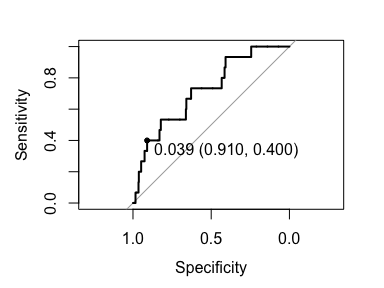

This document is to provide an introductory tutorial to `lr2cluster` package. The package implements tools to help identify cluster assignments using multiple data sources when some direct methods such as contact tracing and genomic sequencing are only available for some data. There are also complimentary functions, such as to estimate a cluster’s size increment and to choose which new cases to be sequenced next. This tutorial provides an overview of `lr2cluster`’s basic functionalities.


# Installing Package

To install the package, you need to install package remotes first:


```r
install.packages("remotes")
```

Once remotes is successfully installed, run the following to install and load `lr2cluster`:


```r
remotes::install_github("ksusvita92/lr2cluster")
library(lr2cluster)
```


# Valencia Data

The package provides a data of _M.tuberculosis_ in Valencia, Spain between 2014 and 2016. It consist of 11 variables and 531 observations, in which 363 are unclustered cases (noted by `tr_cl = unique`).


```r
data("tb_valencia")
str(tb_valencia)
```

```
## 'data.frame':	531 obs. of  11 variables:
##  $ id_server: chr  "G01" "G02" "G03" "G04" ...
##  $ tr_cl    : chr  "unique" "unique" "unique" "CL003" ...
##  $ age      : int  23 39 45 52 30 53 40 46 45 29 ...
##  $ sex      : chr  "FEMALE" "MALE" "FEMALE" "MALE" ...
##  $ foreign  : chr  "YES" "No" "No" "No" ...
##  $ dx_data  : Date, format: "2013-12-27" "2014-02-03" ...
##  $ location : chr  "Pulmonar" "Pulmonar" "Pulmonar" "Pulmonar" ...
##  $ diabetes : chr  "No" "YES" "YES" "No" ...
##  $ hiv      : chr  "No" "No" "No" "YES" ...
##  $ latitude : num  39.9 40 40 40 40.5 ...
##  $ longitude: num  -0.157 -0.028 -0.0697 -0.1074 0.4048 ...
```

To see the documentation of each variable, run `?tb_valencia`.


## Transform to pairwise-level data

Pairwise-level data is a data used in the pairwise logistic regression model. This data represents the similarity (if the variable is categoric) and distance (if the variable is numeric) between a pair of cases. For example, in the Valencia data, latitude and longitude are the columns that represent the geographical location of an individual. Then the pairwise-level of these variables is the spatial distance between two cases.


To transform Valencia data into pairwise-level data, run:


```r
dt <- tb_valencia[tb_valencia$tr_cl != "unique",] #exclude unclustered cases
pairdt <- zCovariate(cluster = dt$tr_cl,
                     X = dt[,3:9],
                     location = dt[,10:11],
                     .removeRepetition = T, #.removeRepetition = F to keep all pairs
                     id = dt$id_server)
head(pairdt)
```

```
##   case to.case y   Spatial age  sex foreign dx_data location diabetes  hiv
## 1  G19     G04 0  66.78369  22 MALE    DIFF       4 Pulmonar       No DIFF
## 2  G24     G04 0  84.94556  12 DIFF      No      65 Pulmonar       No DIFF
## 3  G60     G04 0  98.18234   7 MALE    DIFF     432 Pulmonar       No DIFF
## 4  G76     G04 0 185.13454  25 DIFF      No      17 Pulmonar       No DIFF
## 5  G77     G04 1 185.13454   6 MALE      No      59 Pulmonar       No  YES
## 6  G78     G04 0 159.54006  12 DIFF      No      10 Pulmonar       No DIFF
```


Notice that there are 4 new columns in the data frame above: `case`, `to.case`, `y`, and `Spatial.`

  + `case`, `to.case`: vector of case id; together represent a pair.
  + `y`: a binary variable; `y = 1` means if a pair is in the same cluster, `y = 0` means otherwise.
  + `Spatial`: numeric vector that represents spatial distance between a pair. 
  
Each categorical variable will have one additional level, called `DIFF` which indicates if a pair has different values. To see more details about the function above, run `?zCovariate`.


# Pairwise Logistic Regression

There are two logistic regression models introduced in this package: the multinomial logistic regression (MLR) and the pairwise logistic regression (PLR). The difference between the two models lies on the data type used to train the model, and the response variable. For instance, MLR uses individual-level data and the response variable is the index of the cases’ clusters, whereas PLR uses pairwise-level data and binary response variable.


## Fit PLR model

PLR perform regression analysis which maps pairwise predictors to a binary response variable. Suppose we want to fit predictors `sex`, `foreign`, `dx_data`, and `latitude` and `longitude.`


```r
fit_plr <- plr(formula = tr_cl ~ sex+foreign+dx_data+latitude+longitude,
               data = dt)
summary(fit_plr)
```

```
## 
## Call:
## glm(formula = mod, family = binomial(), data = traindata)
## 
## Deviance Residuals: 
##     Min       1Q   Median       3Q      Max  
## -0.4496  -0.2444  -0.1854  -0.1208   3.7963  
## 
## Coefficients:
##               Estimate Std. Error z value Pr(>|z|)    
## (Intercept) -3.4959623  0.1704252 -20.513  < 2e-16 ***
## sexFEMALE    0.2240378  0.1939951   1.155    0.248    
## sexMALE      0.2077319  0.1270605   1.635    0.102    
## foreignNo    0.5688820  0.1391698   4.088 4.36e-05 ***
## foreignYES   1.1097600  0.2038516   5.444 5.21e-08 ***
## dx_data     -0.0003023  0.0002209  -1.369    0.171    
## Spatial     -0.0157692  0.0016022  -9.842  < 2e-16 ***
## ---
## Signif. codes:  0 '***' 0.001 '**' 0.01 '*' 0.05 '.' 0.1 ' ' 1
## 
## (Dispersion parameter for binomial family taken to be 1)
## 
##     Null deviance: 2869.9  on 14027  degrees of freedom
## Residual deviance: 2697.7  on 14021  degrees of freedom
## AIC: 2711.7
## 
## Number of Fisher Scoring iterations: 7
```

`summary()` function provides the estimated regression coefficients, together with their statistic t-test. An important note for the users is if ones want to fit spatial distance between two cases, ones must name the geographical location as `latitude` (or `lat`), and `longitude` (or `long`).


## Predict if two cases are in the same cluster

Suppose there are a collection of new cases which we have no information on their true clusters, and we want to predict the probability if a pair belongs to the same cluster. To illustrate this, let us split the `tb_valencia` data into two, one is to train the PLR model and the other is to test the model. 

To make sure we split the data such that there are at least one case per cluster in each data split, use `createDataPartition()` from `caret` package. In this example, we set 60% proportion of the data to be in training set.


```r
library(caret)
```

```
## Loading required package: ggplot2
```

```
## Loading required package: lattice
```

```r
set.seed(12345)
id <- createDataPartition(dt$tr_cl, p = .6, list = F)
traindt <- dt[id,]
testdt <- dt[-id,]
```

Use `plr()` function to fit PLR model on `traindt`, and run the following to get the estimated probability of the response variable:


```r
fit_plr <- plr(formula = tr_cl ~ sex+foreign+dx_data+latitude+longitude,
               data = traindt)
pred_plr <- predict(obj = fit_plr,
                    newdata = testdt,
                    case.id = testdt$id_server) #case.id can be NULL
```

The function `predict.plr()` (or `predict()`) returns a data frame which contains a vector of the predicted probability if a pair of cases are in the same cluster, and its standard error.


## Finding the optimum threshold
As in any binary classification problem where a threshold must be selected, `lr2cluster` provides a function to find an optimum threshold which depends on how the user values the cost of false positive errors (saying two cases are in the same cluster when they are not) versus false negative errors (saying two cases are not in the same cluster when they are).

The function `optThreshold()` requires a vector of the true response variable and its prediction. The later is obtained from `pred_plr$y`, and to obtain the former, use `zCovariate()` function on `testdt`.


```r
# get the true response variable of testdt data
tr_resp <- zCovariate(cluster = testdt$tr_cl)$y
opt_threshold <- optThreshold(response = tr_resp,
                              prediction = pred_plr$y,
                              cost.ratio = 50) #default is 1
```

```
## Setting levels: control = 0, case = 1
```

```r
opt_threshold
```

```
## 
##  -- The optimum threshold using generalized Youden's index -- 
## ==================================================================
##  
##   threshold specificity sensitivity    accuracy         auc 
##  0.03851649  0.90960452  0.40000000  0.90426275  0.71972693
```

`optThreshold()` returns a list of values, such as:

  + `threshold`: the optimum threshold obtained, given `cost.ratio`.
  + `specificity`, `sensitivity`: the true negative rate and the true positive rate, evaluated at the optimum threshold.
  + `accuracy`: accuracy of the prediction.
  + `roc``: an object of class "roc".
  
To plot the ROC, you can run:


```r
plot(opt_threshold)
```

<!-- -->

which also shows the position of the optimum threshold given `cost.ratio`.


# Cluster Assignment

The previous section is to predict if some new cases belong to the same cluster. However, ones may wonder if those cases may belong to one of the known clusters in the training set. This section is addressed to find the most probable clusters a new case can be assigned to based on some scores called _cluster scores_. These scores, which are on a scale between 0 to 1, represent how likely a new case belong to some clusters.


## Finding probable clusters a case most likely to belong to

The cluster assignment can be done by setting a threshold or choosing the best _K_ clusters with higher ranks. If a threshold if provided, any clusters whose scores are less than the threshold will be omitted. Otherwise, the method will assign a case to the best _K_ clusters with higher ranks.

To do this task, we will use `traindt` and `testdt` again, so that we can test the accuracy of our assignments. We will use the same variables as the previous section as well.


```r
assgn_plr <- clusterPLR(formula = tr_cl ~ sex+foreign+dx_data+latitude+longitude,
                        data = traindt,
                        newdata = testdt,
                        threshold = NULL,
                        nbest = 3)
assgn_plr
```

```
## 
##  -- Cluster assignment using pairwise logistic regression -- 
## ================================================================
##  
## Choosing the best 3 clusters. 
## Showing only the first six cases.
##  
##   rank_1 rank_2 rank_3
## 1  CL072  CL021  CL001
## 2  CL010  CL001  CL055
## 3  CL003  CL017  CL023
## 4  CL074  CL001  CL011
## 5  CL020  CL070  CL068
## 6  CL026  CL012  CL019
```

The code above is to find the best _K = 3_ clusters a case can be assigned to using PLR model. If ones want to compare the method using random assignment or MLR model, run `clusterRandom()` or `clusterMLR()`.


To obtain the best probable clusters for all new cases, run:


```r
getbest(assgn_plr) #or
assgn_plr$best_cluster
```

To obtain the cluster scores, run:


```r
getclusterScore(assgn_plr) #or
assgn_plr$cluster_score
```

See `?clusterPLR`, `?clusterRandom`, and `?clusterMLR` for more details.


## Compute the accuracy for correctly assigning cases to their clusters

The accuracy in this context is the fraction of new cases whose true clusters is in the best _K_ clusters predicted. For example, suppose that a case’s true cluster is "Cluster A". If "Cluster A" is predicted as one of the _K_ clusters, then the method will consider the assignment correct.

To compute the accuracy for predicting the new cases assignment, run


```r
acc(obj = assgn_plr, true.cluster = testdt$tr_cl)
```


# Other Application

## Cases to be sequenced next

Instead of predicting clusters a case can be assigned to, we can turn this relationship around, and ask, for a given cluster, which unassigned cases are most likely to belong to it. This could be used, for example, to decide which of several unsequenced cases should be sequenced next, if we are interested in identifying all the cases that belong to a particular cluster.

To do this task, run


```r
next_case <- case2sequence(obj = assgn_plr,
                           case.id = testdt$id_server,
                           nbest = 3)
next_case
```

```
## 
##  -- Predict cases to be sequenced next given clusters -- 
## =============================================================
##  
## Choosing the best 3 cases to be sequenced next. 
## Showing only few cases.
##  
##   cluster  priority_1  priority_2 priority_3
## 1   CL001       G1570        G788       G201
## 2   CL002      G1105m        G164       G932
## 3   CL003 G641m,G1246        <NA>       G108
## 4   CL004        G233       G536m      G641m
## 5   CL007        G249       G536m       G932
## 6   CL008       G693m G623m,G882m       <NA>
```


The above code returns the suggested 3 cases to be chosen given a cluster based on their cluster score’s rank. If ones want to find _K_ best cases, change _nbest = K_ or, ones can also provide a threshold which serves as a cut-off to any cases with lower score.

To obtain the best cases for all clusters, run


```r
getbest(next_case) #or
next_case$best_cases
```


To obtain the accuracy of this task, run


```r
acc(obj = next_case, true.cluster = testdt$tr_cl)
```


## Estimate a cluster’s size increment

Suppose that we have a cluster of interest _C_ with some cases in it, and a collection of unassigned new cases. We can estimate the total number of new cases that would get assigned to _C_, and therefore estimate the increment of cluster _C_’s size.


```r
clusterSize(obj = assgn_plr, rho = 0)
```


The argument `rho` in `clusterSize()` represents the probability that a case does not belong to any of any given clusters.


# Closing Remarks

`lr2cluster` is a tool to assign newly identified cases of an infectious disease to existing transmission clusters using several data streams. The application is extended to also for example, predict which new cases to be sequenced next, given a cluster, and estimate a cluster’s size increment.

For some general questions and bug report, please send to ksusvita@gmail.com.
